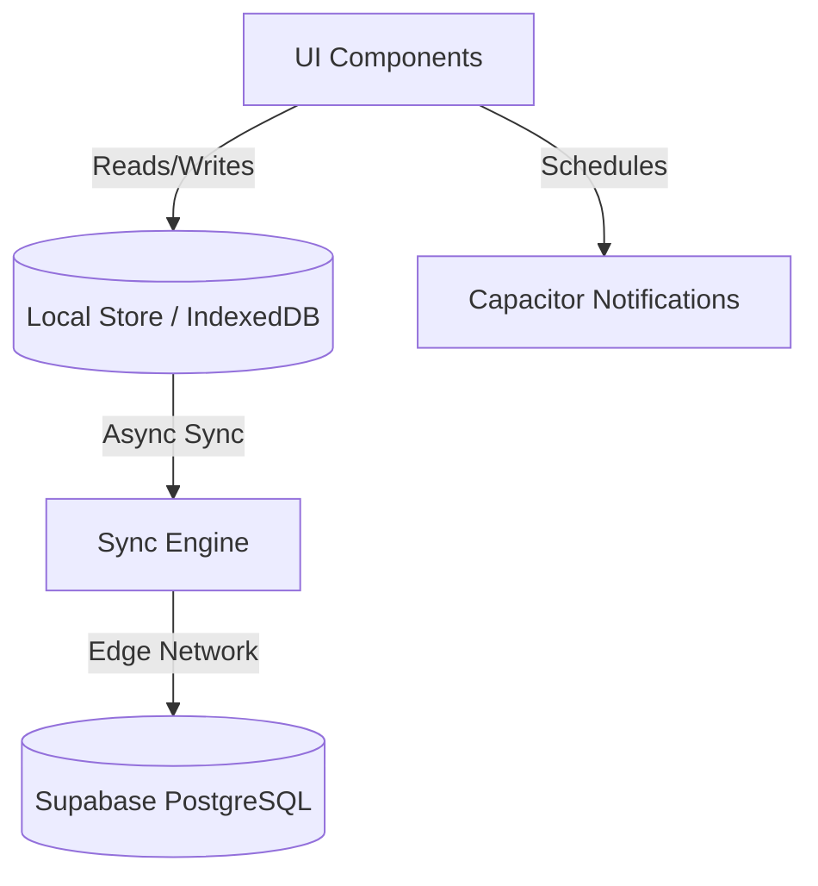

# Architecture Spine — SpendWise Zero-Friction Engine

## Design Paradigm

**Local-First Thick Client with Supabase Edge Sync**
The application functions entirely as a standalone client reading and writing to an embedded local database/store. Background synchronizers replicate mutations to Supabase when network connectivity is available, ensuring <10ms responsiveness and offline availability.

## Invariants & Rules



### AD-1 — Core Engine executes Client-Side
- **Binds:** Safe-to-Burn (StB) and Life-Energy computations.
- **Prevents:** Network latency breaking the < 10ms calculation goal (NFR-1).
- **Rule:** Computations must run in the browser/app using local state, syncing asynchronously to Supabase.

### AD-2 — Single-Source-of-Truth Local Store
- **Binds:** Data layer, UI state.
- **Prevents:** Divergent state during offline use or tearing between UI components.
- **Rule:** The app reads exclusively from a local reactive store (e.g., IndexedDB/Zustand) acting as a write-through cache.

### AD-3 — Optimistic UI Updates
- **Binds:** Transaction entry, Willpower logs, Regret ratings.
- **Prevents:** UI blocking while waiting for network responses.
- **Rule:** User actions mutate local state instantly; network sync resolves eventual consistency in the background.

### AD-4 — RLS for Privacy
- **Binds:** Supabase DB Schema.
- **Prevents:** Wage data leakage and cross-user data exposure.
- **Rule:** The `user_settings` and `transactions` tables must enforce PostgreSQL Row Level Security tied to `auth.uid()`.

### AD-5 — Device-Native Notification Scheduling
- **Binds:** 14-day Regret check-in.
- **Prevents:** Missing prompts when the device is offline or when server crons fail.
- **Rule:** Schedule prompts via `@capacitor/local-notifications` (or Web APIs) at the time of purchase logging.

## Consistency Conventions

| Concern | Convention |
| --- | --- |
| Naming (entities, files) | PascalCase for React components, snake_case for DB columns. |
| Data & formats | ISO-8601 for dates, Monetary amounts stored as integers (cents) in DB, converted to decimals for UI. |
| State & cross-cutting | Errors caught at boundary layers; all user-facing state fetched exclusively from the local store. |

## Stack

| Name | Version |
| --- | --- |
| React | 18 |
| Capacitor | 8 |
| Vite | Latest |
| TailwindCSS | Latest |
| Supabase PostgreSQL | Latest |

## Structural Seed

```text
c:\Projects\SpendWise/
  src/
    components/      # UI components following DESIGN.md
    features/        # Domain-specific logic (StB Engine, Life-Energy, Willpower)
    store/           # Local reactive store (Zustand/IndexedDB wrappers)
    sync/            # Background Supabase sync handlers
  supabase/
    migrations/      # Schema and RLS policies
```
